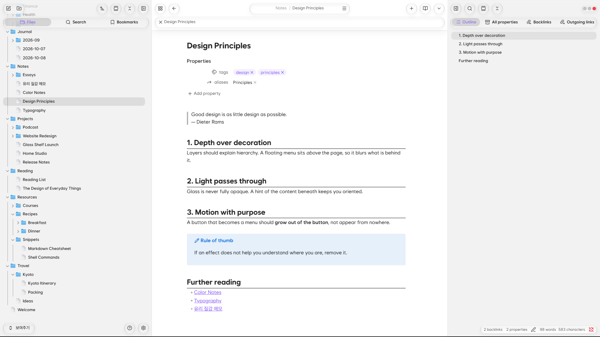
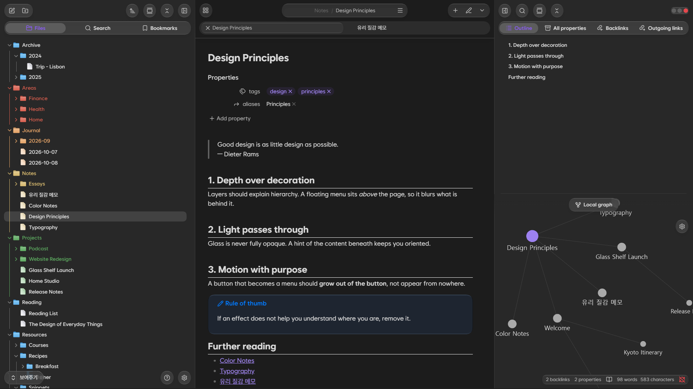

# Glass Shelf (테마)

[English](README.md) · **한국어**

반투명한 유리 질감의 Obsidian 테마입니다.

> **Glass Shelf 플러그인이 필요합니다.** 이 테마는 Glass Shelf 플러그인과 함께 쓰도록 만들었습니다. 테마와 플러그인을 모두 설치하고 켜야 의도한 화면이 완성됩니다.

  
  

## 특징

- 패널, 메뉴, 팝업을 흐린 유리로 표현하는 글래스모피즘
- 알약 모양 버튼과 곡률이 서서히 바뀌는 둥근 모서리 (Chromium 139 이상)
- 원티드 산스 기반 글꼴 내장 (별도 설치 불필요)
- 폴더·문서 아이콘

## 동반 플러그인

**Glass Shelf 플러그인**이 버튼 재배치, 굴절 효과, 애니메이션, 세부 설정을 담당합니다. 테마는 유리 표현을, 플러그인은 배치와 움직임을 맡는 구조입니다.

## 지원 환경

- **PC와 안드로이드 환경을 중심으로 제작했습니다.**
- iPhone·iPad에서는 굴절 효과가 작동하지 않아, 대신 흐림(블러) 처리만 적용됩니다.
- macOS는 충분히 테스트하지 못해 일부 표현이 어색할 수 있습니다.
- 둥근 모서리의 곡률 효과는 Chromium 139 이상에서 보입니다.

## 설치

1. **설정 → 모양 → 테마 → 관리**에서 **Glass Shelf**를 검색해 설치하고 켭니다.
2. **설정 → 커뮤니티 플러그인**에서 **Glass Shelf** 플러그인을 설치하고 켭니다.

## 출처

- 글꼴: [Wanted Sans](https://github.com/wanteddev/wanted-sans)를 줄인 판, SIL Open Font License 1.1

## 후원

Glass Shelf가 마음에 드셨다면 커피 한 잔으로 응원해 주세요.

## 라이선스

테마 코드는 [MIT](LICENSE), 내장 글꼴은 SIL OFL 1.1을 따릅니다.
