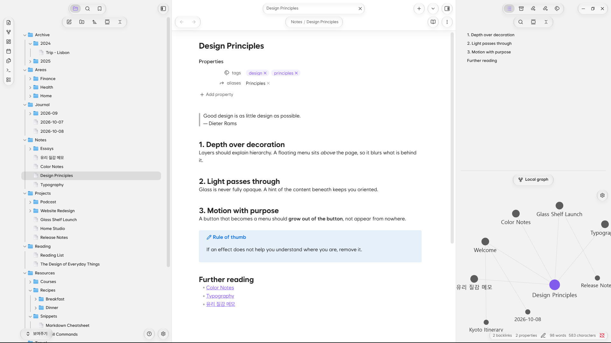

# Glass Shelf (Theme)

**English** · [한국어](README.ko.md)

A translucent, glassy theme for Obsidian.

> **Requires the Glass Shelf Companion plugin.** This theme is built to be used together with the Glass Shelf Companion plugin. Install and enable both to get the intended look.

  
  

## Theme only vs. with the plugin

The screenshots above show the theme together with the Companion plugin. With the theme alone, the glass looks the same, but the button layout, refraction and animations are not there.

| Theme only | With the Companion plugin |
|---|---|
|  |  |
## Features

- Glassmorphism: panels, menus and popups rendered as blurred glass
- Pill-shaped buttons and rounded corners with smoothly changing curvature (Chromium 139 or later)
- Built-in font based on Wanted Sans (no separate install needed)
- Folder and file icons

## Companion plugin

The **[Glass Shelf Companion](https://github.com/ummbition/glass-shelf-plugin) plugin** handles button layout, refraction, animation and fine-grained settings. The theme draws the glass; the plugin handles layout and motion.

## Supported platforms

- **Built mainly for desktop (Windows) and Android.**
- On iPhone and iPad, refraction does not work, so only blur is applied.
- macOS has not been tested thoroughly, so some details may look off.
- The smooth corner curvature is visible on Chromium 139 or later.

## Installation

1. In **Settings → Appearance → Themes → Manage**, search for **Glass Shelf**, then install and enable it.
2. Install and enable the **Glass Shelf Companion** plugin in **Settings → Community plugins**.

## Credits

- Font: a subset of [Wanted Sans](https://github.com/wanteddev/wanted-sans), SIL Open Font License 1.1 (full text: [OFL.txt](OFL.txt))

## Support

If you enjoy Glass Shelf, you can support it with a coffee.

## License

Theme code is under the [MIT](LICENSE) license. The bundled font is under SIL OFL 1.1 ([OFL.txt](OFL.txt)).
